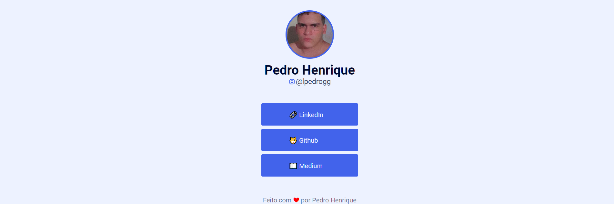

<h1 align="center"> Página de links para o Instagram </h1>

A DocPay é um projeto desenvolvido com o intuito de estudos <strong>HTML, estilos, semânticas</strong> | <a style="color: #C2410C" href="https://serene-semolina-d61582.netlify.app/">Disponível agora.</a>

  <a href="#tecnologias">Tecnologias</a>&nbsp;&nbsp;&nbsp;|&nbsp;&nbsp;&nbsp;
  <a href="#projeto">Projeto</a>&nbsp;&nbsp;&nbsp;|&nbsp;&nbsp;&nbsp;
  <a href="#memo-licença">Licença</a>

  

  

## 🚀 Tecnologias

Esse projeto foi desenvolvido com as seguintes tecnologias:

</a>
</a>
</a>
</a>

 

## 💻 Projeto

Projeto desenvolvido para colocar na BIO do instagram.

## 📝 Licença

Esse projeto está sob a licença MIT.

---

Feito com ❤ by Pedro Henrique. <a style="color: #C2410C" href="https://www.linkedin.com/in/lpedrogg/">Veja meu Perfil no LinkedIn</a>

